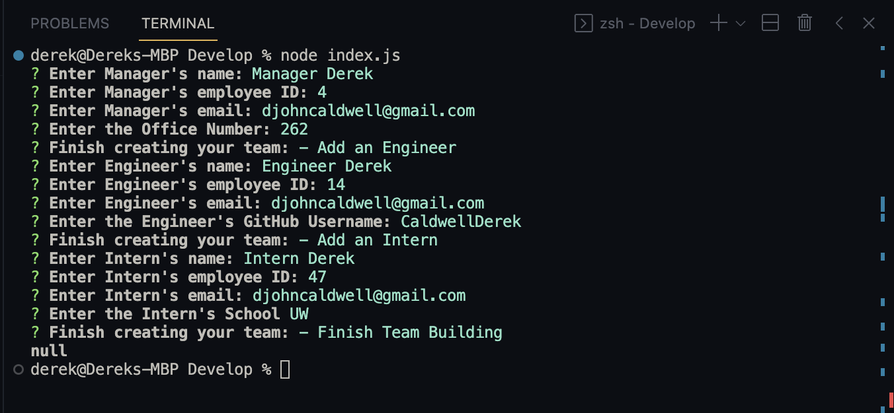
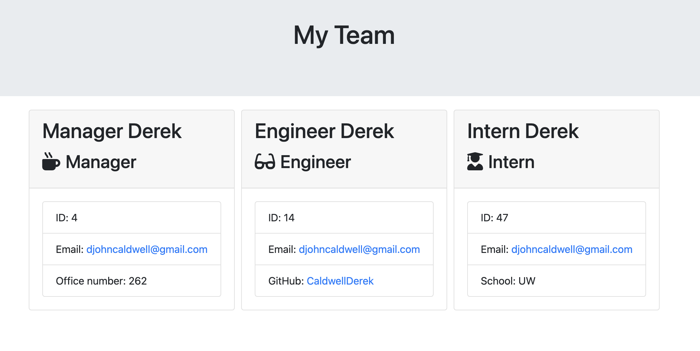

# Team Profile Generator

## Table of Contents
1. [Description](#description)
2. [Installation](#installation)
3. [Usage](#usage)
4. [Contributing](#contributing)
5. [Tests](#tests)
6. [License](#license)
7. [Questions](#questions)

## Description
This is a command-line application that generates an HTML webpage displaying summaries of each individual on a project team. This application makes use of the npm Inquirer and Jest packages.

## Installation
All dependencies are uploaded to the application's repository. After cloning the code, running npm install in the integrated terminal will download the necessary packages to run the application.

## Usage
Quickly generate and compile teammember information in the form of a webpage.

## Contributing
This application is open and free to be used/updated by anyone.

## Tests
A series of test suites were used to make sure the functionality of the classes were operating as they should be. These suites can be viewed under the "tests" folder.

## License
This application is currently covered under the MIT License. More information about this license can be viewed under the file named 'LICENSE' in the repository.

## Questions
If you have any questions, feel free to reach out to me at my email: djohncaldwell@gmail.com

All of my work can be viewed at my GitHub profile: [CaldwellDerek](https://github.com/CaldwellDerek)

## Media

Sample Command Line execution of the application:

Sample result after application execution:

